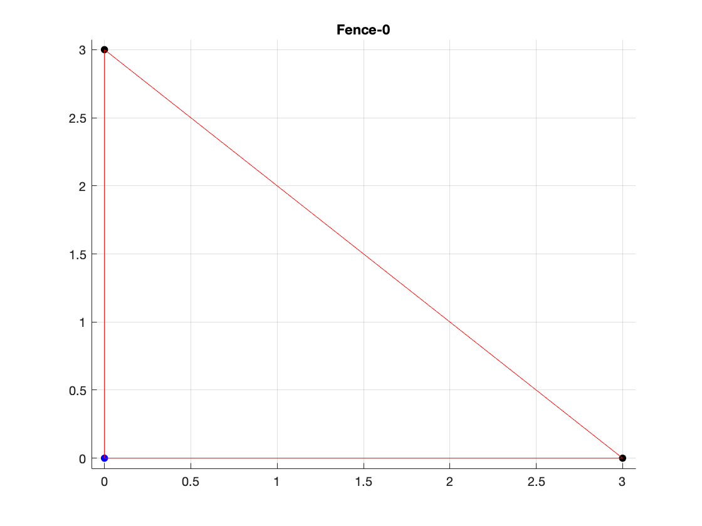
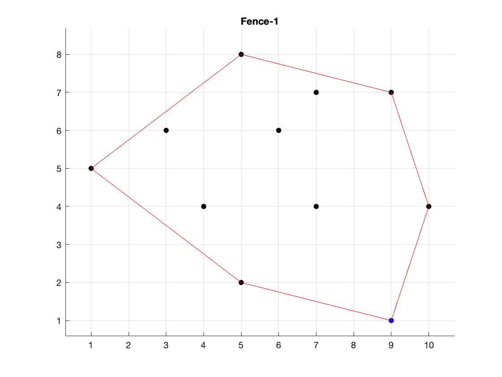
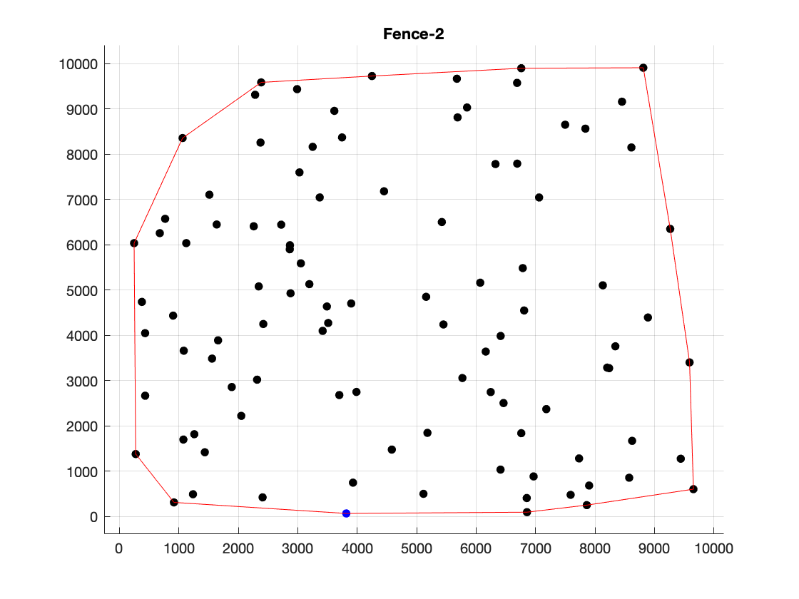

# Challenge
University of Maryland Computer Science Northrop Grumman [Challenge Box](https://challengebox.cs.umd.edu/2019/index.html) (October 2019)

## fancy-fence
Build smallest fence around a cluster of trees - [Convex hull](https://en.wikipedia.org/wiki/Convex_hull) algorithm. The input and output files can be found [here](http://challengebox.cs.umd.edu/2019/Fence).

## in-prime-shape
Cryptography system based on prime numbers.
